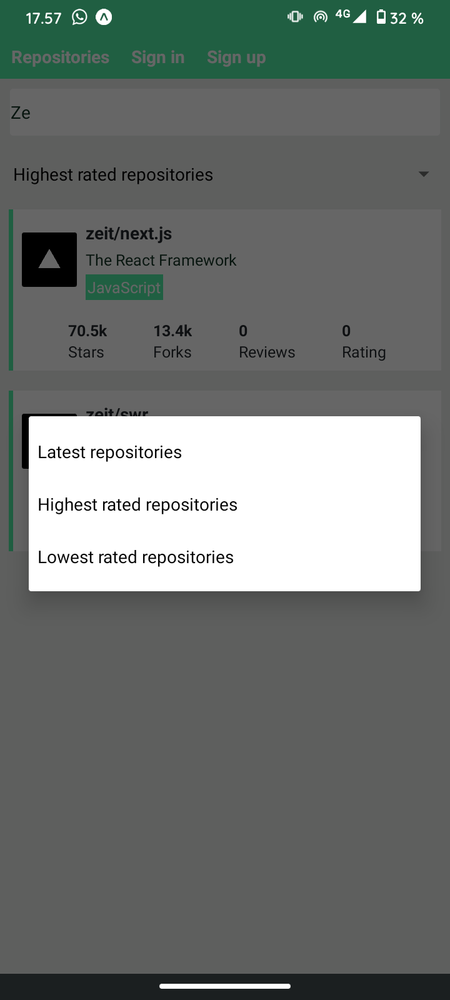
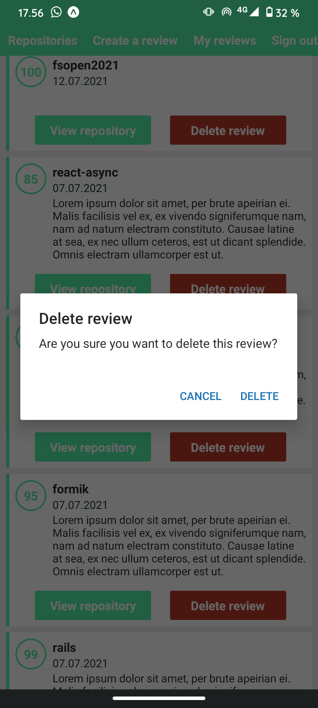
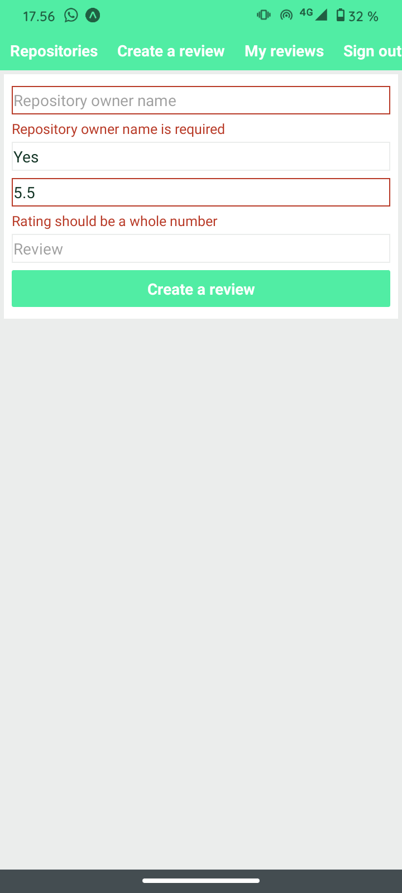
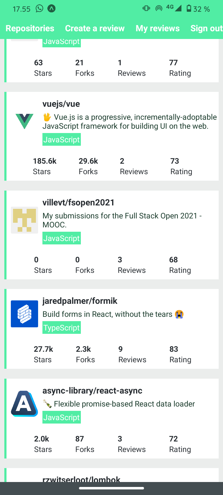

# fsopen2021-reactnative
Separate repository for the React Native part of Fullstack Open MOOC. Main repo at https://github.com/villevt/fsopen2021

Includes a self-developed React Native app part for rating GitHub repositories, and a forked backend for GraphQL requests.

### Features:
* Login state management
* Infinite-scrolling list of repositories, accessible as separate items
* Reading reviews on separate repositories
* Reviewing repositories
* Deleting one's comments

