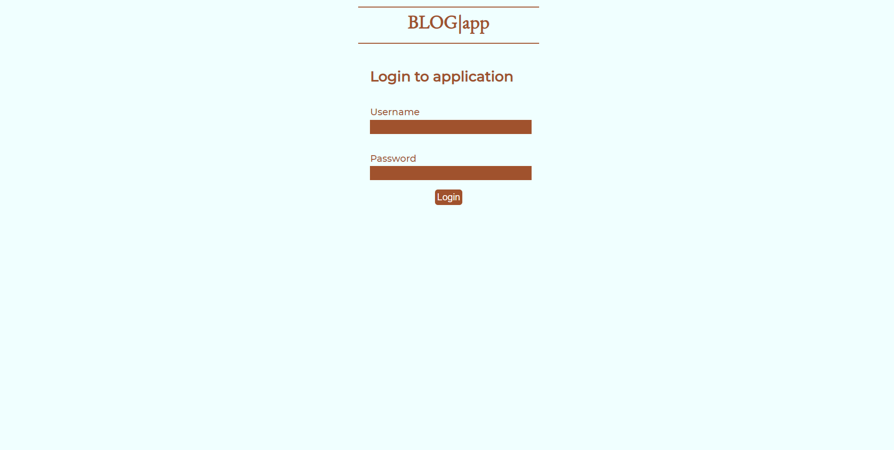
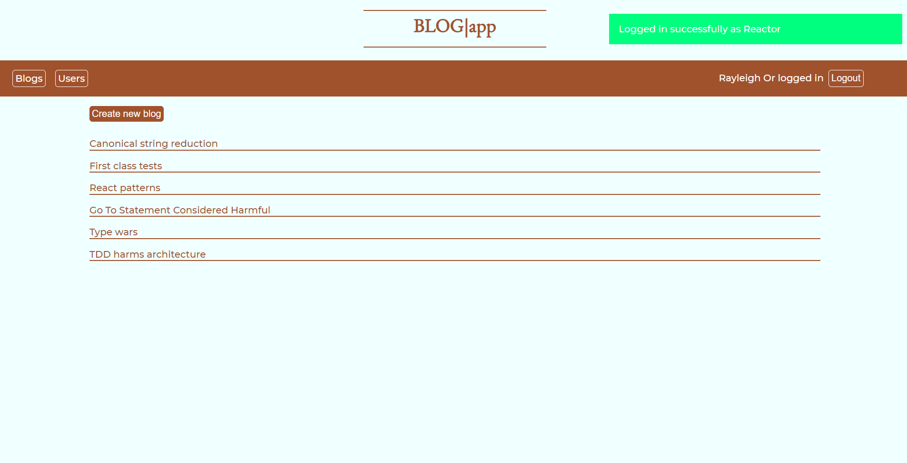
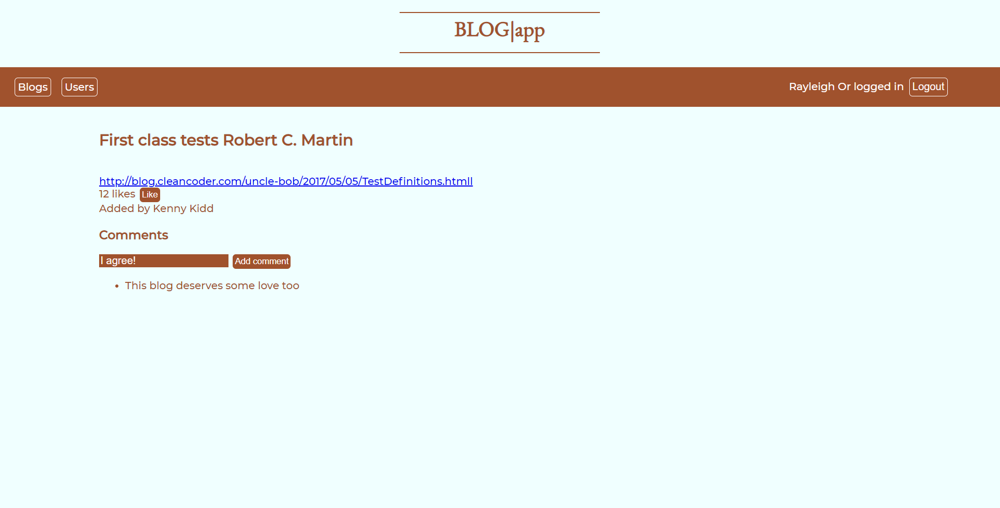
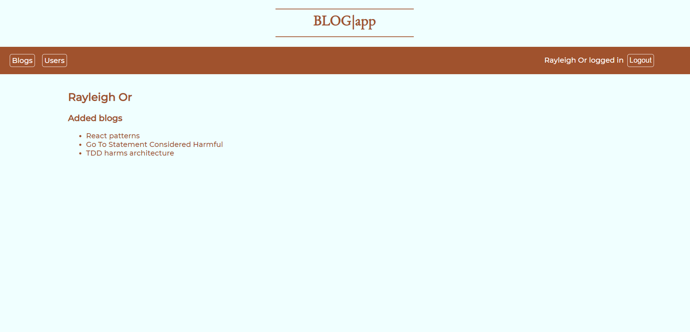

# Frontend for the bloglist application

Made in React, tested with Jest and Cypress.

In this section, the application was extended to use Redux stores, and have additional comment functionality, as well as multiple views. Furthermore, it was styled with CSS (styled components).

#### Features:
* JWT-based authentication for login
* Viewing bloglist fetched from backend with Axios (toggleable simple and detailed view)
* Ability to like blogs (blogs are ordered according to likes)
* Creating new blogs
* Removing blogs posted by the user
* Commenting on blogs
* Views for login, list of blogs, individual blogs, list of users and individual users

