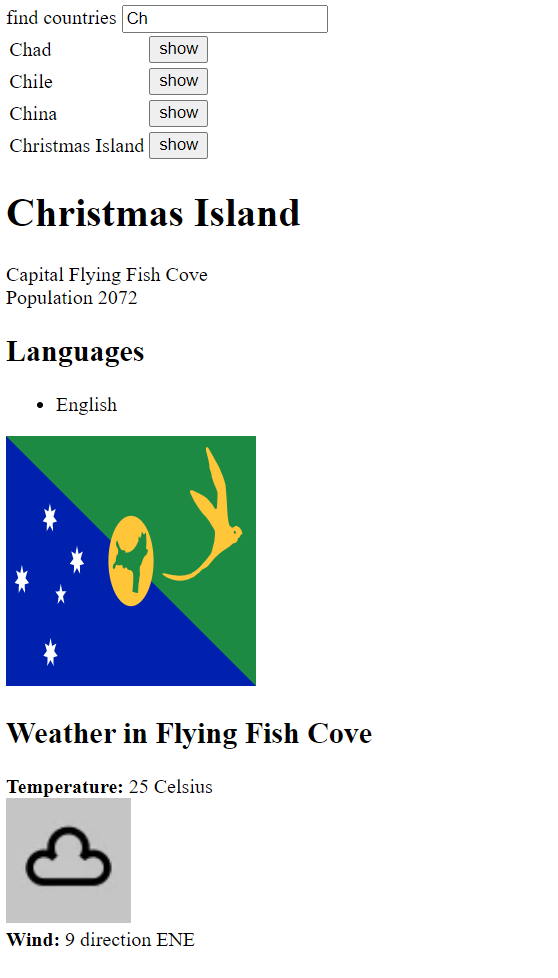

### Data for Countries

Retrieves country and weather data from two separate APIs.
Has a search filter for the data, and displays detailed information for one country at a time based on selection.

