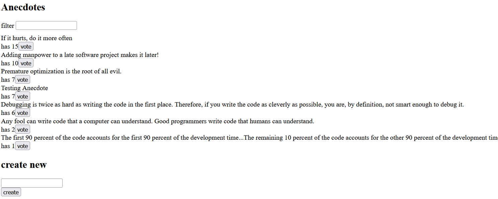

#### Anecdotes

Similiar to anecdotes from part 1. This time, state management is done with Redux.

#### Features:

* Displays a list of anecdotes from JSON-server backend, sorted by votes
* Vote for anecdotes
* Filter anecdotes
* Add new anecdotes

