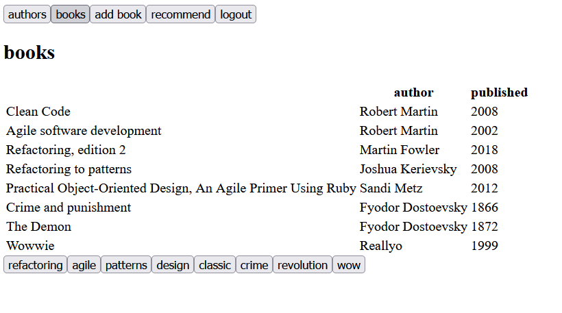
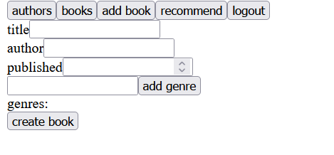

# Library-frontend

Frontend of a "library" app. Done with a combination of React and Apollo client to query data with GraphQL.

#### Features:
* Login and logout
* View authors and edit birthyears
* List of books with genre filters
* Adding new books
* Viewing personal recommendations by genre
* Books are updated through GraphQL subscriptions

