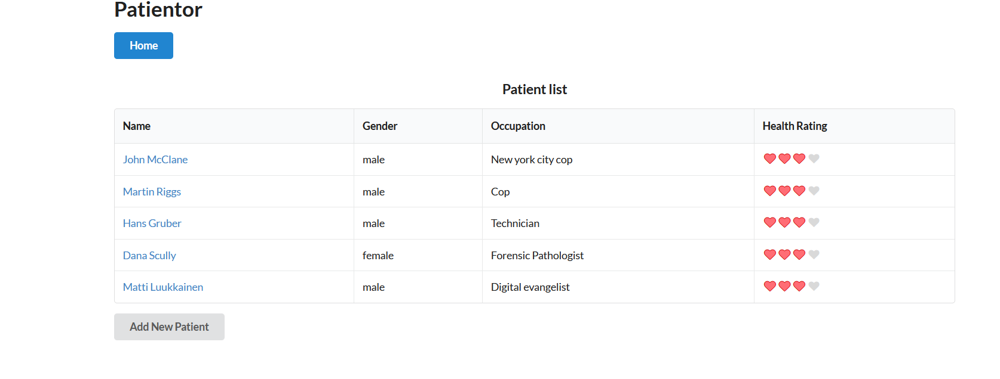
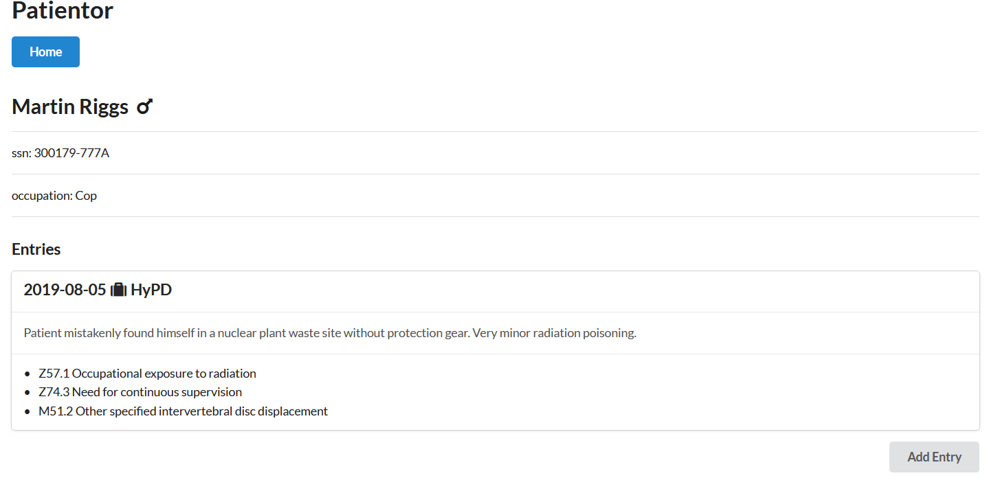

# Patientor - frontend

Simple electronic medical record app. Supports viewing a list of patients and their invididual health entries.
Additionally, supports adding new patients as well as entries.

Made with TypeScript on React.

